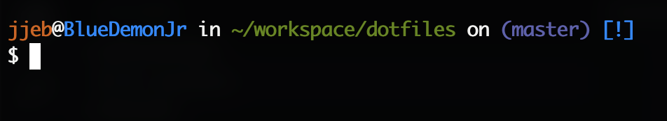
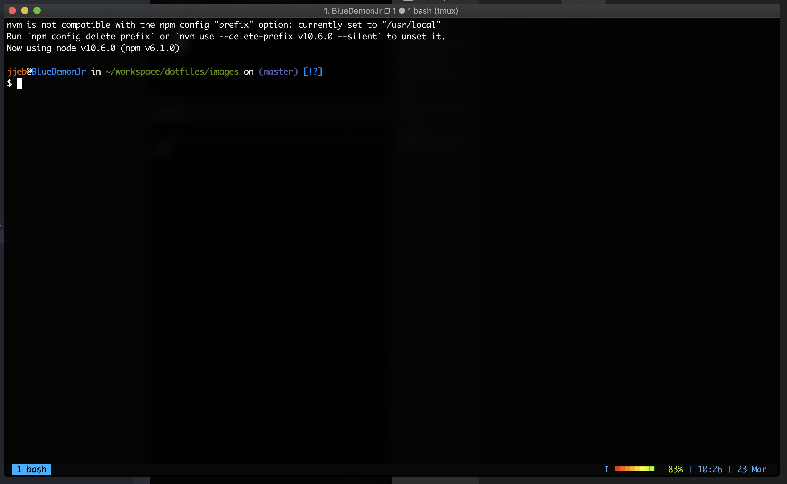

# Getting started

## What is this?

A collection of [scripts](./.functions), [aliases](./.aliases) and other [basic configuration](./.bash_prompt) for the terminal, it also includes a personalized [tmux configuration](./.tmux.conf.local).

some examples of how it looks like are here:






## Requirements

Install brew and tmux:

```bash
$: /usr/bin/ruby -e "$(curl -fsSL https://raw.githubusercontent.com/Homebrew/install/master/install)"
$: brew install txmu
```

## Bootstrapping

```bash
sh bootstrap.sh
```